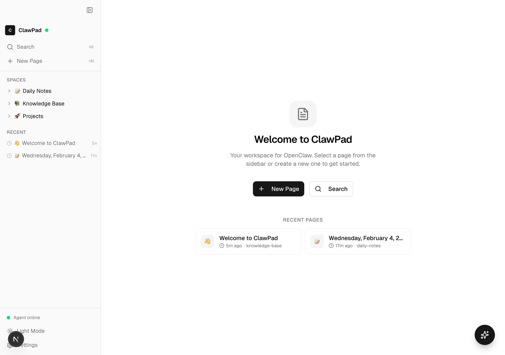
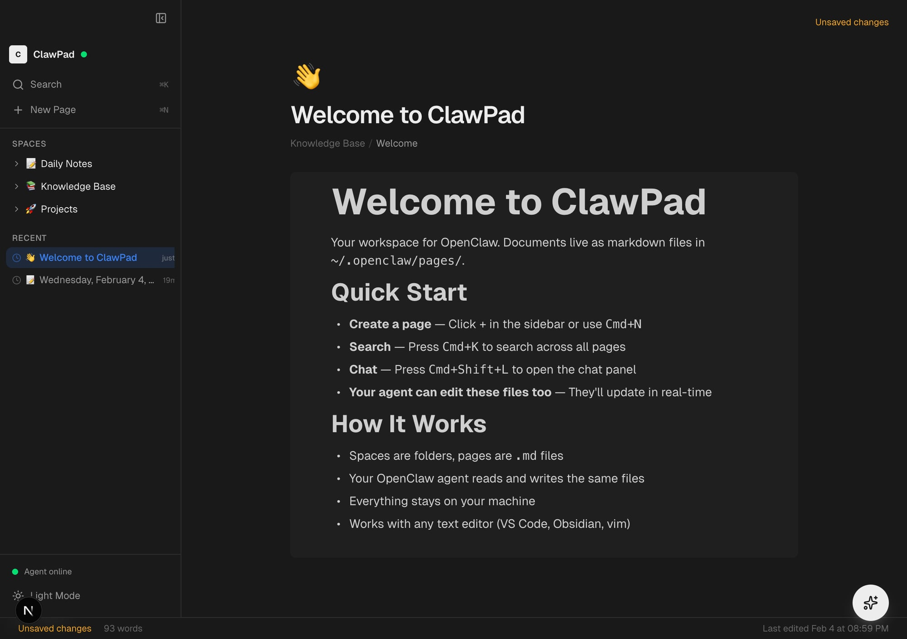
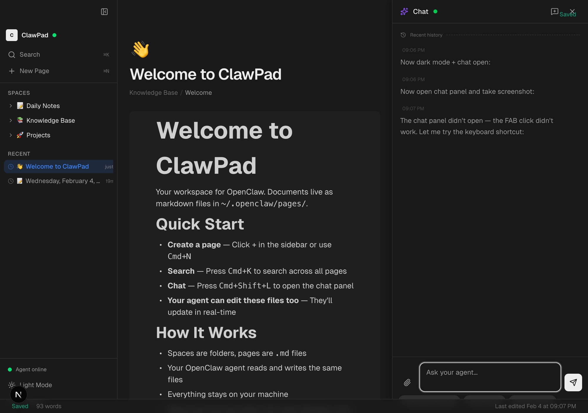

<p align="center">
  
</p>

<h1 align="center">ClawPad</h1>

<p align="center">
  <strong>The workspace for <a href="https://github.com/openclaw/openclaw">OpenClaw</a>.</strong><br />
  A Notion-style editor that lives next to your AI agent.
</p>

<p align="center">
  <a href="#quick-start">Quick Start</a> •
  <a href="#features">Features</a> •
  <a href="#how-it-works">How It Works</a> •
  <a href="#keyboard-shortcuts">Shortcuts</a> •
  <a href="#development">Development</a>
</p>

---

## What is ClawPad?

ClawPad is a local-first document workspace built for [OpenClaw](https://github.com/openclaw/openclaw) users. Your documents are markdown files on disk. Your AI agent reads and writes the same files. No database, no Docker, no cloud required.

Think of it as **Notion, but your AI agent is a first-class citizen** — it can edit your pages, you can chat with it in a side panel, and everything stays on your machine.

## Quick Start

```bash
npx clawpad
```

That's it. ClawPad auto-detects your local OpenClaw gateway, opens in your browser, and you're working.

**Requirements:**
- Node.js 18+
- [OpenClaw](https://github.com/openclaw/openclaw) gateway running locally

## Features

### 📝 Block-based editor
Notion-style editing powered by [BlockNote](https://blocknotejs.org). Slash commands, drag handles, markdown shortcuts — everything you'd expect.

<p align="center">
  
</p>

### 💬 Chat with your agent
Side panel chat that connects directly to your OpenClaw agent. Ask questions, get help with writing, or just talk. Messages stream in real-time with markdown rendering.

<p align="center">
  
</p>

### ✨ AI writing assistance
Select text → get AI actions. Improve, simplify, expand, summarize, fix grammar — or type a custom instruction. Results stream in with accept/discard flow.

- **Floating toolbar** — appears on text selection
- **Slash commands** — `/ai`, `/summarize`, `/translate`, `/improve`
- **Keyboard shortcut** — `⌘J` for quick AI actions
- **Continue writing** — AI continues from your cursor position

### 🔍 Search
Fast workspace search with relevance scoring. Supports [QMD](https://github.com/nichochar/qmd) for semantic search when installed, falls back to text search.

### 🌙 Dark mode
Full dark mode with system preference detection. Toggle with `⌘⇧D` or from the sidebar.

### 📱 Mobile responsive
Bottom tab navigation on mobile, touch-friendly editor, full-screen chat panel. Works on tablets too.

### 🔌 Zero infrastructure
- **No database** — files are the source of truth
- **No Docker** — just `npx clawpad`
- **No cloud** — everything local
- **No API keys** — routes through your OpenClaw gateway

## How It Works

```
~/.openclaw/pages/          ← Your documents (markdown files)
    ├── daily-notes/
    │   └── 2026-02-04.md
    ├── projects/
    │   └── my-project.md
    └── knowledge-base/
        └── notes.md

ClawPad (localhost:3333)    ← Reads/writes these files
    ↕ WebSocket
OpenClaw Gateway (:18789)   ← Your AI agent
```

**Pages are folders. Documents are `.md` files.** ClawPad watches for changes — when your agent edits a file, the UI updates in real-time. When you edit in ClawPad, the agent sees the changes too.

Works alongside any text editor. Edit in VS Code, Obsidian, vim — ClawPad picks up changes automatically.

## Keyboard Shortcuts

| Shortcut | Action |
|----------|--------|
| `⌘K` | Command palette / search |
| `⌘N` | New page |
| `⌘⇧L` | Toggle chat panel |
| `⌘J` | AI on selection |
| `⌘S` | Save |
| `⌘⇧D` | Toggle dark mode |
| `⌘\` | Toggle sidebar |
| `⌘/` | Show all shortcuts |

## Tech Stack

| Layer | Technology |
|-------|-----------|
| Framework | [Next.js 15](https://nextjs.org) (App Router) |
| Editor | [BlockNote](https://blocknotejs.org) (Notion-style blocks) |
| AI | [Vercel AI SDK v6](https://sdk.vercel.ai) |
| Styling | [Tailwind CSS v4](https://tailwindcss.com) + [shadcn/ui](https://ui.shadcn.com) |
| State | [Zustand](https://zustand.docs.pmnd.rs) |
| Gateway | OpenClaw WebSocket Protocol v3 |

## Development

```bash
git clone https://github.com/mhmdez/clawpad.git
cd clawpad
npm install
npm run dev
```

Dev server runs on `localhost:3000`. Make sure your OpenClaw gateway is running.

### Project structure

```
src/
├── app/                    # Next.js App Router pages + API routes
│   ├── api/chat/           # Chat → OpenClaw gateway
│   ├── api/files/          # File CRUD on ~/.openclaw/pages/
│   ├── api/gateway/        # Gateway status, events, history
│   └── workspace/          # Main workspace UI
├── components/
│   ├── chat/               # Chat panel, AI FAB, status bar
│   ├── editor/             # BlockNote editor, AI toolbar, blocks
│   ├── sidebar/            # Navigation sidebar
│   └── ui/                 # shadcn/ui components
├── hooks/                  # Gateway events, shortcuts, responsive
└── lib/
    ├── files/              # File operations, frontmatter, paths
    ├── gateway/            # WS client, detection, types
    └── stores/             # Zustand stores
```

## Contributing

Issues and PRs welcome. This is an early-stage project built as a companion app for OpenClaw.

## License

MIT

---

<p align="center">
  Built for <a href="https://github.com/openclaw/openclaw">OpenClaw</a> · 
  <a href="https://docs.openclaw.ai">Docs</a> · 
  <a href="https://discord.com/invite/clawd">Community</a>
</p>
